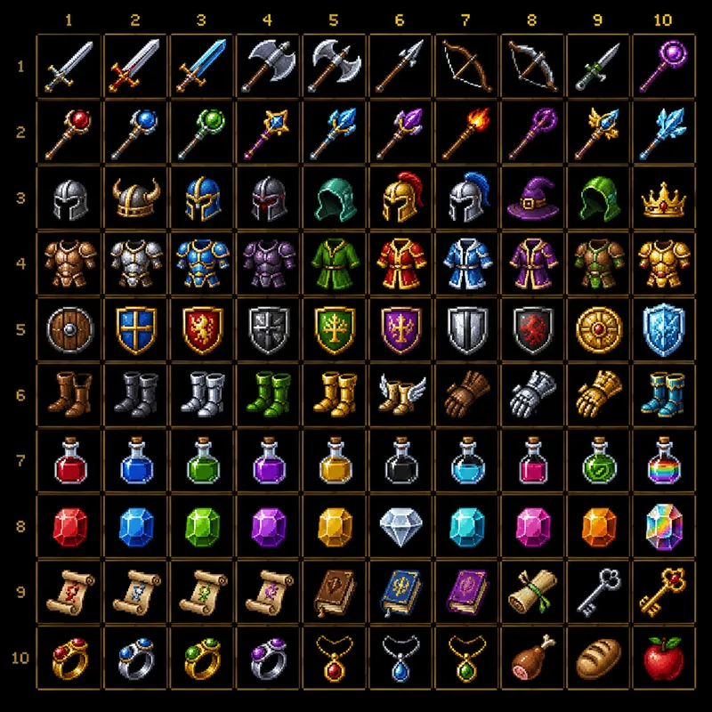
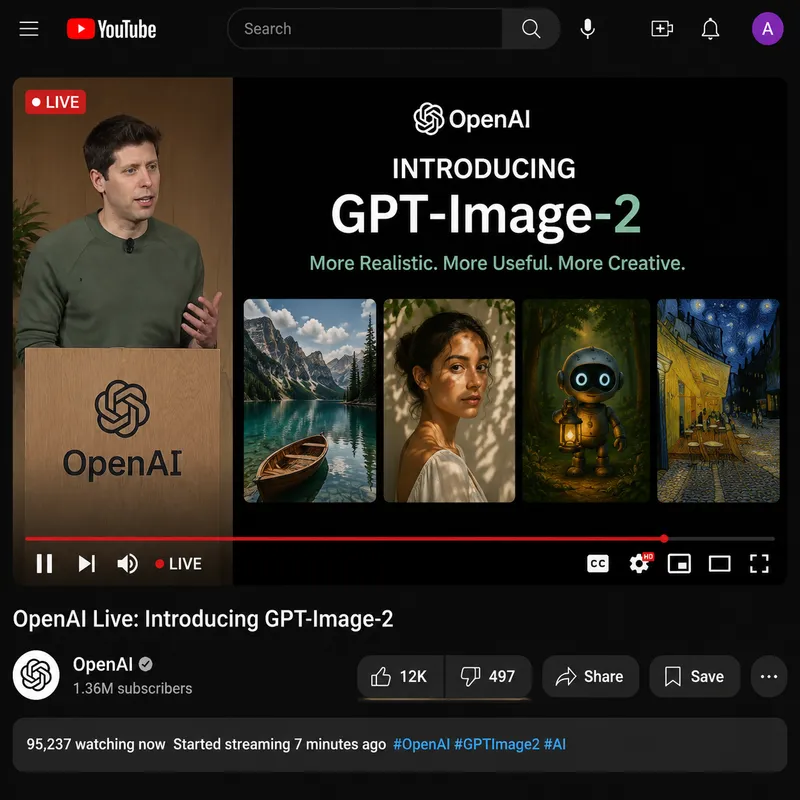

# Skill Gallery · AI 生图风格案例库

> 浏览、筛选、一键下载 —— 565+ AI 生图风格案例的精选展示站。

[](https://nextjs.org)
[](https://react.dev)
[](https://tailwindcss.com)
[](https://www.typescriptlang.org)
[](LICENSE)

Skill Gallery 是一个开源的 **AI 生图风格提示词展示站**，把分散的 GPT Image 风格案例整理成可视化卡片库，支持按 **分类 / 风格 / 场景** 三维度筛选，关键词秒级搜索，点击即可下载对应的 Skill 提示词包。

---

> 🎁 **想要更强的 AI 创作能力？**
> 微信搜索小程序 **「积木智能体」**，体验一站式 AI 生图、生视频、做 PPT、写文案等 40+ 智能体能力，本仓库的所有 Skill 提示词均可在小程序中直接调用。

---

## ✨ 特性

- 🎨 **565+ 精选案例** —— 涵盖 UI、海报、品牌、建筑、人物、插画等 13 大分类
- 🔍 **三维度筛选 + 全文搜索** —— 分类（13） / 风格（19） / 场景（10） 任意组合，关键词防抖搜索
- 🖼 **瀑布流 + 无限滚动** —— IntersectionObserver 实现流畅的分页加载
- 💚 **点赞互动** —— IP 维度限流的轻量点赞系统
- ⚡ **WebP 极致压缩** —— sharp 构建期压缩，q=80，首屏秒开
- 📦 **一键下载** —— Nginx 静态直链下载 Skill 提示词包
- 🐳 **Docker 一键部署** —— 内置 `docker-compose.yml` + Nginx 反向代理
- 🔐 **管理接口热更新** —— Token 鉴权的案例追加接口，无需重新构建
- 🌐 **CORS 友好** —— 公开接口支持跨域，方便第三方接入

## 🖼 预览

<p align="center">
  
  
  
</p>

## 🛠 技术栈

| 层级 | 技术 |
|------|------|
| 框架 | Next.js 16 (App Router) + React 19 |
| 语言 | TypeScript 5 |
| 样式 | Tailwind CSS 4 |
| 动画 | Motion (framer-motion) |
| 图标 | lucide-react |
| 图片处理 | sharp + WebP |
| 数据存储 | JSON 文件（无需数据库） |
| 部署 | Docker + Nginx |

## 🚀 快速开始

### 本地开发

```bash
# 克隆仓库
git clone https://github.com/JiMu-cn/skill-gallery.git
cd skill-gallery

# 安装依赖（推荐 pnpm）
pnpm install

# 启动开发服务器
pnpm dev
```

打开 [http://localhost:3000](http://localhost:3000) 即可访问。

### 环境变量

```bash
cp .env.example .env
```

```env
# 管理接口 Token（必须设置）
# 生成方式: openssl rand -hex 32
ADMIN_TOKEN=your-strong-random-token-here

# 上线后开启 HTTPS 强制检查
# REQUIRE_HTTPS=true

# 允许跨域的来源域名（逗号分隔），* 表示允许所有
ALLOWED_ORIGINS=*
```

## 📦 项目结构

```
skill-gallery/
├── public/
│   ├── images/              # WebP 压缩后的案例图片
│   └── skills/              # Skill 提示词压缩包（供下载）
├── data/
│   ├── skills.json          # 案例元数据
│   ├── filters.json         # 筛选器配置（分类/风格/场景）
│   └── likes.json           # 点赞数据
├── scripts/
│   ├── compress-images.ts   # 图片批量压缩为 WebP
│   ├── generate-filters.ts  # 筛选器配置生成
│   └── process-all.ts       # 一键处理脚本
├── src/
│   ├── app/
│   │   ├── page.tsx         # 首页
│   │   └── api/
│   │       ├── skills/      # 列表接口
│   │       ├── like/        # 点赞接口
│   │       └── admin/       # 管理接口
│   ├── components/          # FilterSidebar / CaseGrid / Lightbox ...
│   ├── hooks/               # useSkills / useInfiniteScroll ...
│   └── lib/                 # types / utils
├── nginx/
│   └── nginx.conf           # Nginx 反代配置
├── docker-compose.yml
├── docker-compose.prod.yml
└── Dockerfile
```

## 🐳 Docker 部署

详细步骤见 [DEPLOY.md](./DEPLOY.md)。

```bash
# 1. 配置 .env
cp .env.example .env
# 编辑 ADMIN_TOKEN 等变量

# 2. 一键构建并启动
docker compose up -d --build

# 3. 查看日志
docker compose logs -f

# 4. 更新部署
git pull && docker compose up -d --build
```

部署架构：

```
用户请求 → Nginx (80/443)
              ├── /images/*   → Docker volume 静态直出 + CORS
              ├── /skills/*   → Docker volume 静态直出 + CORS
              ├── /api/*      → Next.js (3000)
              └── /*          → Next.js (3000)
```

## 🔌 API 接口

### 公开接口（CORS 已开启）

| 接口 | 方法 | 用途 |
|------|------|------|
| `/api/skills` | GET | 案例列表（分页+筛选+点赞数） |
| `/api/like` | GET / POST | 获取/更新点赞数 |
| `/images/*` | GET | 案例图片资源 |
| `/skills/*` | GET | Skill 文件下载 |

```js
// 获取案例列表
const res = await fetch('https://your-domain.com/api/skills?page=1&limit=9');
const { items, total, hasMore } = await res.json();
```

### 管理接口（需要 Bearer Token）

| 接口 | 方法 | 用途 |
|------|------|------|
| `/api/admin/add-case` | POST | 添加新案例（热更新） |

```bash
curl -X POST https://your-domain.com/api/admin/add-case \
  -H "Authorization: Bearer $ADMIN_TOKEN" \
  -F "image=@case.webp" \
  -F "title=案例标题" \
  -F "category=Posters & Typography" \
  -F "style=Poster" \
  -F "scene=Commerce"
```

完整 API 文档见 [DEPLOY.md](./DEPLOY.md#api-接口文档)。

## 🤝 贡献

欢迎提交 Issue 和 Pull Request！

1. Fork 本仓库
2. 创建特性分支 `git checkout -b feat/your-feature`
3. 提交变更 `git commit -m 'feat: add xxx'`
4. 推送分支 `git push origin feat/your-feature`
5. 提交 Pull Request

如需贡献新案例，请按以下格式整理：

- 高质量图片（建议 800px+，会自动压缩为 WebP）
- 提示词文本文件
- 准确的分类 / 风格 / 场景标签（见 [data/filters.json](data/filters.json)）

## 🌟 关于积木智能体

**积木智能体** 是一站式 AI 创作平台，覆盖：

- 🎨 **AI 生图**：Gemini / Seedream / Nova / MiniMax 等多模型
- 🎬 **AI 生视频**：Hailuo / Remotion 视频创作
- 🎵 **AI 音乐 / 语音合成**：MiniMax 全套音频能力
- 📊 **AI PPT / 文档**：自动生成专业演示文稿
- 🧩 **3D 模型生成**：Tripo 文生 3D / 图生 3D
- 🤖 **40+ 智能体技能**：可直接调用本仓库 Skill 提示词

> **微信扫码或搜索小程序「积木智能体」立即体验** 👇
>
> 本仓库所有 Skill 案例均可在小程序内一键应用，搭配多模型生图能力效果更佳。

## 📄 License

[MIT](./LICENSE) © JiMu-cn

## 🙏 致谢

- [Next.js](https://nextjs.org) · [Tailwind CSS](https://tailwindcss.com) · [Motion](https://motion.dev)
- 提示词风格案例参考自社区开源数据集

## 🏢 关于我们

- 官网：[积木科技](https://jimu.chat)
- GitHub：[@JiMu-cn](https://github.com/JiMu-cn)
- 反馈邮箱：[admin@jimu.chat](mailto:admin@jimu.chat)
